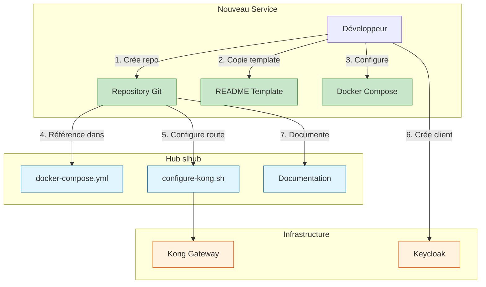

# Guide : Ajouter un nouveau microservice

Ce guide explique comment créer et intégrer un nouveau microservice dans l'écosystème slhub.

## 🎯 Convention de nommage

### Nommage des repositories

**Format recommandé : `[domaine-metier]-service`**

✅ **Exemples corrects :**
- `user-service` (gestion utilisateurs)
- `product-catalog` (catalogue produits)
- `order-management` (gestion commandes)
- `notification-hub` (notifications)
- `payment-gateway` (paiements)

❌ **À éviter :**
- `nestjs-users` (nom basé sur la techno)
- `service-users` (redondant)
- `users-microservice` (trop long)

### Nommage des conteneurs Docker

**Format : `[nom-service]-[techno]`**

Exemples :
- `user-service-nestjs`
- `product-catalog-spring`
- `order-management-go`

## 📋 Checklist de création

### 1. Créer le repository Git

```bash
# Créer le repo sur GitHub/GitLab
# Nom : [domaine-metier]-service

# Cloner localement
cd /home/lcg/workspaces
git clone https://github.com/YOUR_USERNAME/[nom-service]
cd [nom-service]
```

### 2. Copier le template README

```bash
# Copier le template depuis slhub
cp /home/lcg/workspaces/slhub/docs/templates/MICROSERVICE_README_TEMPLATE.md README.md

# Éditer et remplir les sections
# - Remplacer [Nom du Service]
# - Remplacer [Framework], [Langage], [Base de données]
# - Compléter la description métier
# - Lister les endpoints
# - etc.
```

### 3. Ajouter les topics GitHub

Topics recommandés :
- `microservice`
- `slhub`
- `learning`
- `[nom-framework]` (ex: `nestjs`, `spring-boot`, `fastapi`)
- `[nom-langage]` (ex: `typescript`, `java`, `python`)
- `docker`
- `keycloak`
- `oauth2`

### 4. Créer la structure Docker

```bash
mkdir -p docker

# Créer docker/compose.yaml
cat > docker/compose.yaml << 'EOF'
services:
  [nom-service]:
    image: [nom-service]:dev
    container_name: [nom-service]
    restart: always
    env_file:
      - env/config.env
    ports:
      - "[PORT]:[PORT]"
    networks:
      - services
    healthcheck:
      test: wget -q -O /dev/null http://localhost:[PORT]/health || exit 1
      interval: 10s
      timeout: 5s
      retries: 5

networks:
  services:
    name: lcg-solutions
    external: true
EOF
```

### 5. Configurer l'authentification Keycloak

#### Dans Keycloak (http://localhost:8080)

1. Se connecter à la console admin
2. Sélectionner le realm `slhub`
3. Aller dans **Clients** → **Create Client**
4. Configuration :
   ```
   Client ID: [nom-service]
   Client Type: confidential
   ```
5. **Capability config** :
   - ✅ Client authentication
   - ✅ Authorization
6. **Valid Redirect URIs** :
   - `http://localhost:8000/*`
   - `http://localhost:[PORT]/*`
7. Sauvegarder et récupérer le **Client Secret** dans l'onglet **Credentials**

#### Dans votre service

Configurer les variables d'environnement :
```env
KEYCLOAK_URL=http://keycloak:8080
KEYCLOAK_REALM=slhub
KEYCLOAK_CLIENT_ID=[nom-service]
KEYCLOAK_CLIENT_SECRET=[secret-from-keycloak]
```

### 6. Intégrer au hub slhub

#### Ajouter au docker-compose.yml principal

```bash
cd /home/lcg/workspaces/slhub
```

Éditer `docker-compose.yml` et ajouter :

```yaml
include:
  # ... services existants ...

  # Nouveaux services
  - path: /home/lcg/workspaces/[nom-service]/docker/compose.yaml
```

#### Configurer les routes Kong

Éditer `infrastructure/kong/configure-kong.sh` et ajouter :

```bash
# ========================================
# Service [Nom du Service]
# ========================================
echo "📦 Configuration du service [Nom du Service]..."

# Créer le service
curl -s -X POST ${KONG_ADMIN}/services \
  --data "name=[nom-service]" \
  --data "url=http://[nom-service]:[PORT]" > /dev/null

# Créer la route
curl -s -X POST ${KONG_ADMIN}/services/[nom-service]/routes \
  --data "name=[nom-service]-route" \
  --data "paths[]=/api/[resource]" \
  --data "strip_path=false" > /dev/null

echo "✅ [Nom du Service] configuré"
```

### 7. Tester l'intégration

```bash
# Depuis slhub
cd /home/lcg/workspaces/slhub

# Démarrer tous les services
./up.sh

# Configurer Kong
./infrastructure/kong/configure-kong.sh

# Tester la route
curl http://localhost:8000/api/[resource]

# Avec authentification
TOKEN="your-jwt-token"
curl -H "Authorization: Bearer $TOKEN" http://localhost:8000/api/[resource]
```

### 8. Documenter le service

Mettre à jour la documentation :

1. **README du service** : Compléter toutes les sections
2. **slhub README** : Ajouter le service dans la liste
3. **Architecture** : Mettre à jour les schémas Mermaid si nécessaire

## 🏗️ Structure recommandée du repository

```
[nom-service]/
├── README.md                    # Documentation complète (depuis template)
├── CHANGELOG.md                 # Historique des versions
├── .gitignore
├── .env.example                 # Variables d'environnement exemple
│
├── src/                         # Code source
│   ├── main.[ext]
│   ├── controllers/
│   ├── services/
│   ├── models/
│   └── config/
│
├── tests/                       # Tests
│   ├── unit/
│   ├── integration/
│   └── e2e/
│
├── docker/                      # Configuration Docker
│   ├── compose.yaml            # Docker Compose standalone
│   ├── Dockerfile              # Image du service
│   └── env/
│       └── config.env.example
│
├── docs/                        # Documentation spécifique
│   ├── api.md
│   └── setup.md
│
└── scripts/                     # Scripts utilitaires
    ├── up.sh
    ├── down.sh
    └── test.sh
```

## 📊 Schéma d'intégration



## 🎓 Exemples par technologie

### NestJS (TypeScript)

```bash
# Créer un nouveau projet NestJS
npx @nestjs/cli new user-service
cd user-service

# Ajouter les dépendances Keycloak
npm install keycloak-connect nest-keycloak-connect

# Structure recommandée
user-service/
├── src/
│   ├── auth/
│   ├── users/
│   └── health/
```

### Spring Boot (Java)

```bash
# Créer avec Spring Initializr
curl https://start.spring.io/starter.tgz \
  -d dependencies=web,data-jpa,security,oauth2-client \
  -d name=product-catalog \
  -d packageName=com.slhub.products | tar -xzf -

cd product-catalog
```

### FastAPI (Python)

```bash
# Créer le projet
mkdir notification-hub
cd notification-hub
python -m venv venv
source venv/bin/activate

# Installer FastAPI
pip install fastapi uvicorn python-keycloak

# Structure
notification-hub/
├── app/
│   ├── main.py
│   ├── routers/
│   └── models/
└── requirements.txt
```

### Go

```bash
# Créer le projet
mkdir order-management
cd order-management
go mod init github.com/YOUR_USERNAME/order-management

# Installer dépendances
go get github.com/gin-gonic/gin
go get github.com/Nerzal/gocloak/v13
```

## 🔍 Validation

Liste de vérification avant de considérer le service comme intégré :

- [ ] Repository créé avec nom métier
- [ ] README complété depuis le template
- [ ] Topics GitHub configurés
- [ ] Docker Compose créé et fonctionnel
- [ ] Client Keycloak créé et configuré
- [ ] Service ajouté au docker-compose.yml du hub
- [ ] Routes Kong configurées
- [ ] Health check fonctionnel (`/health`)
- [ ] Endpoints protégés par authentification
- [ ] Tests unitaires présents
- [ ] Documentation API (Swagger/OpenAPI)
- [ ] Logs au format JSON
- [ ] Métriques Prometheus exposées
- [ ] Service démarré via `./up.sh` du hub
- [ ] Accessible via Kong (http://localhost:8000)
- [ ] Documentation mise à jour dans slhub

## 📚 Ressources

- [Template README](templates/MICROSERVICE_README_TEMPLATE.md)
- [Architecture slhub](architecture/01-architecture-globale.md)
- [Flux d'authentification](architecture/02-flux-authentification.md)
- [Réseau Docker](architecture/03-reseau-docker.md)

## 💡 Conseils

### Pour l'apprentissage

- Commencez simple : un CRUD basique
- Ajoutez progressivement les fonctionnalités
- Documentez ce que vous apprenez dans le README
- Utilisez les patterns de la techno choisie

### Pour la production

- Implémentez un cache (Redis)
- Ajoutez des circuit breakers
- Gérez les transactions distribuées
- Monitoring et alerting complets
- Tests de charge

### Bonnes pratiques

- Un service = un domaine métier
- Évitez les dépendances directes entre services
- Utilisez les événements pour la communication asynchrone
- Chaque service a sa propre base de données
- Versionnez vos APIs (`/v1/api/...`)

## 🆘 Troubleshooting

### Le service ne démarre pas

```bash
# Vérifier les logs
docker compose logs -f [nom-service]

# Vérifier le réseau
docker network inspect lcg-solutions
```

### Kong ne route pas vers le service

```bash
# Vérifier que le service est dans Kong
curl http://localhost:8001/services

# Vérifier les routes
curl http://localhost:8001/routes

# Tester directement le service
docker exec -it kong-gateway curl http://[nom-service]:[PORT]/health
```

### Erreur d'authentification Keycloak

```bash
# Vérifier la configuration du client dans Keycloak
# Vérifier les variables d'environnement
# Vérifier les logs du service
```
