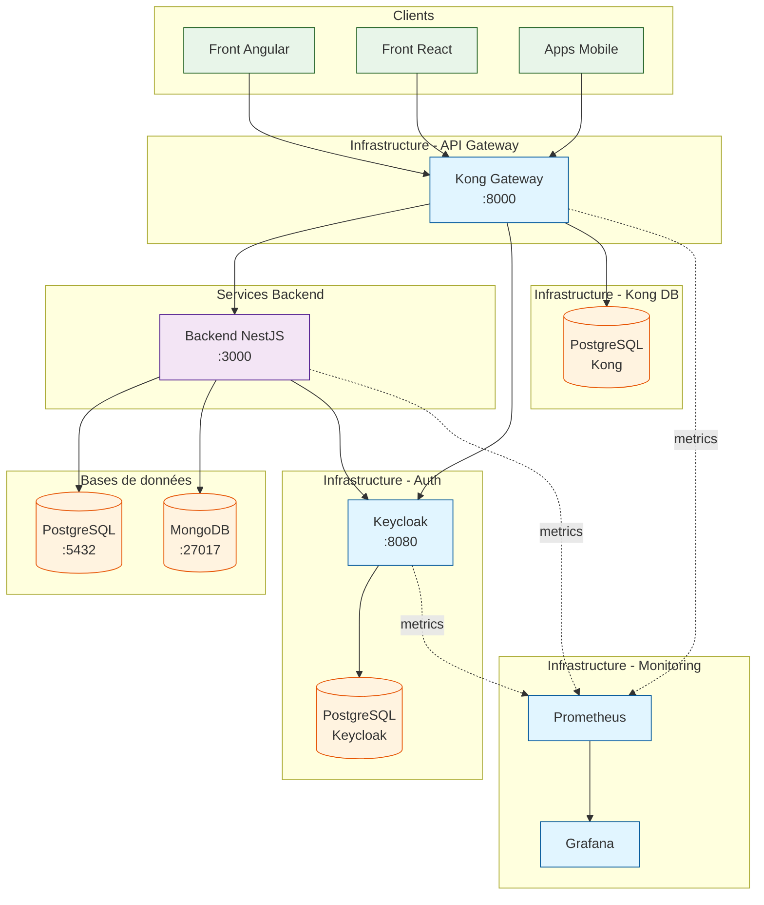
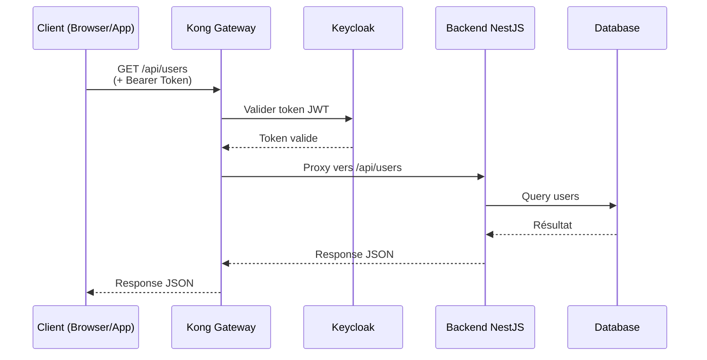

# Architecture Globale - SLHub

## Vue d'ensemble

Architecture microservices avec un hub centralisé utilisant Kong API Gateway, Keycloak pour l'authentification, et monitoring Prometheus/Grafana.

## Composants principaux

### Infrastructure
- **Kong Gateway** : Point d'entrée unique (API Gateway)
- **Keycloak** : Gestion d'identité et authentification (OAuth2/OIDC)
- **Prometheus + Grafana** : Monitoring et métriques

### Services
- **Backend NestJS** : API REST principale
- **Front Angular** : Application front principale
- **Front React** : Application front alternative

### Bases de données
- **PostgreSQL** : Base de données relationnelle
- **MongoDB** : Base de données NoSQL

## Réseau Docker

Tous les services partagent le réseau Docker `lcg-solutions` pour communiquer entre eux.

## Ports exposés

| Service | Port | Description |
|---------|------|-------------|
| Kong Proxy | 8000 | Point d'entrée API (HTTP) |
| Kong Proxy | 8443 | Point d'entrée API (HTTPS) |
| Kong Admin | 8001 | API d'administration Kong |
| Kong Manager | 8002 | Interface web Kong |
| Keycloak | 8080 | Console d'administration et API |
| Backend NestJS | 3000 | API REST (accès direct) |
| PostgreSQL | 5432 | Base de données principale |
| MongoDB | 27017 | Base de données NoSQL |
| Grafana | 3001 | Dashboard de monitoring |
| Prometheus | 9090 | Métriques et alertes |

## Flux de requête standard

## Sécurité

- **Authentification centralisée** : Tous les appels passent par Kong qui vérifie le token Keycloak
- **Réseau isolé** : Les services communiquent via un réseau Docker privé
- **Pas d'accès direct** : Les clients ne peuvent pas accéder directement aux backends (sauf en dev)
