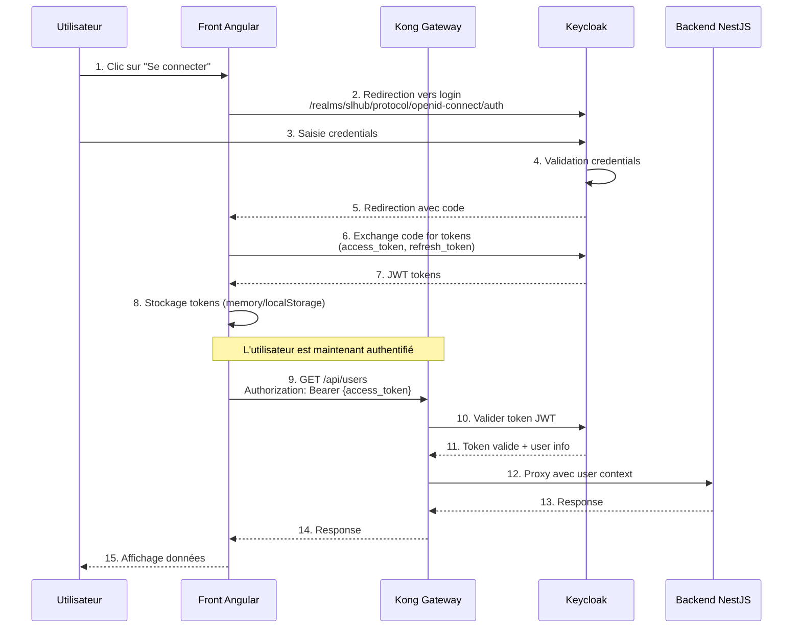
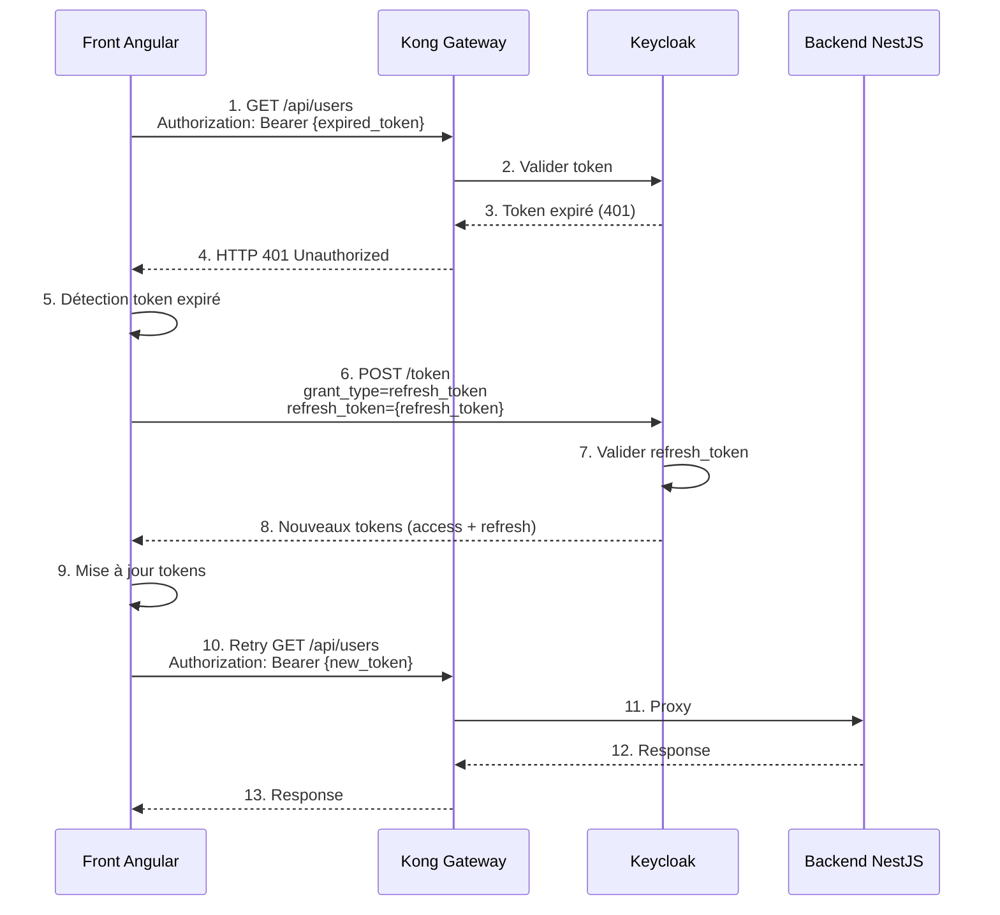
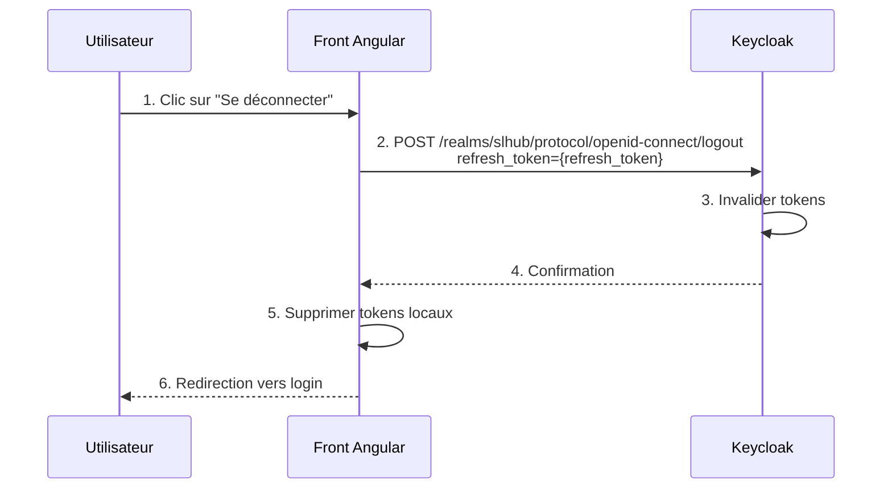
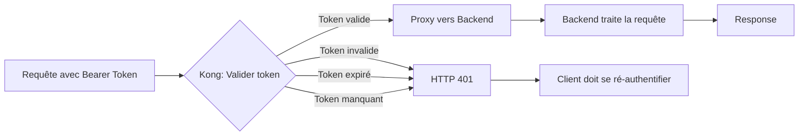

# Flux d'Authentification - SLHub

## Vue d'ensemble

L'authentification dans SLHub utilise le protocole OAuth2/OpenID Connect avec Keycloak comme serveur d'autorisation et Kong comme gateway de validation.

## Flux de connexion utilisateur



## Flux de rafraîchissement de token



## Flux de déconnexion



## Configuration Keycloak requise

### 1. Créer un Realm

```bash
Realm: slhub
```

### 2. Créer les clients

#### Client pour Kong (backend)
```yaml
Client ID: kong
Client Protocol: openid-connect
Access Type: confidential
Valid Redirect URIs: http://localhost:8000/*
```

#### Client pour Front Angular (frontend)
```yaml
Client ID: front-angular
Client Protocol: openid-connect
Access Type: public
Valid Redirect URIs:
  - http://localhost:4200/*
  - http://localhost:4200/callback
Web Origins: http://localhost:4200
```

### 3. Créer des utilisateurs de test

```yaml
Username: testuser
Email: test@slhub.local
Password: password123
Email Verified: Yes
```

## Validation du token par Kong

Kong utilise le plugin `openid-connect` pour valider automatiquement les tokens :



## Structure du JWT

Exemple de payload JWT retourné par Keycloak :

```json
{
  "exp": 1672531200,
  "iat": 1672527600,
  "jti": "abc123...",
  "iss": "http://localhost:8080/realms/slhub",
  "aud": "front-angular",
  "sub": "user-uuid-123",
  "typ": "Bearer",
  "azp": "front-angular",
  "session_state": "session-uuid",
  "name": "John Doe",
  "given_name": "John",
  "family_name": "Doe",
  "preferred_username": "johndoe",
  "email": "john@slhub.local",
  "email_verified": true,
  "realm_access": {
    "roles": ["user", "admin"]
  },
  "resource_access": {
    "front-angular": {
      "roles": ["view-profile"]
    }
  }
}
```

## Gestion des rôles

```mermaid
graph TB
    subgraph "Keycloak"
        Realm[Realm: slhub]
        Realm --> Role1[Role: admin]
        Realm --> Role2[Role: user]
        Realm --> Role3[Role: moderator]
    end

    subgraph "Kong"
        Kong[Kong Gateway]
        Kong --> Check{Vérifier rôle<br/>dans JWT}
    end

    subgraph "Backend NestJS"
        Guard[Auth Guard]
        Guard --> AdminRoute[Route /admin/*]
        Guard --> UserRoute[Route /api/*]
    end

    Check -->|admin| AdminRoute
    Check -->|user| UserRoute
    Check -->|unauthorized| Reject[HTTP 403]
```

## Sécurité

### Bonnes pratiques implémentées

- ✅ **Access tokens courts** : Durée de vie 5-15 minutes
- ✅ **Refresh tokens longs** : Durée de vie 30 jours
- ✅ **HTTPS en production** : Obligatoire pour les tokens
- ✅ **Token validation côté serveur** : Kong vérifie chaque requête
- ✅ **Pas de stockage sensible** : Tokens en memory ou httpOnly cookies

### Points d'attention

- ⚠️ Ne jamais exposer le `client_secret` côté frontend
- ⚠️ Utiliser PKCE pour les clients publics (front Angular)
- ⚠️ Implémenter une liste noire de tokens (optionnel)
- ⚠️ Surveiller les tentatives de connexion échouées
