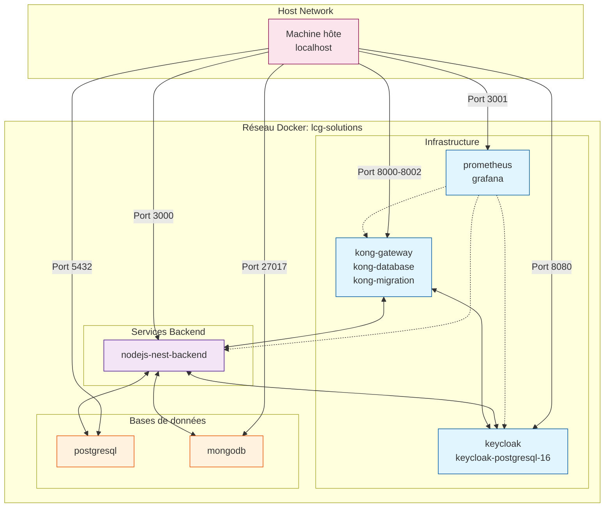
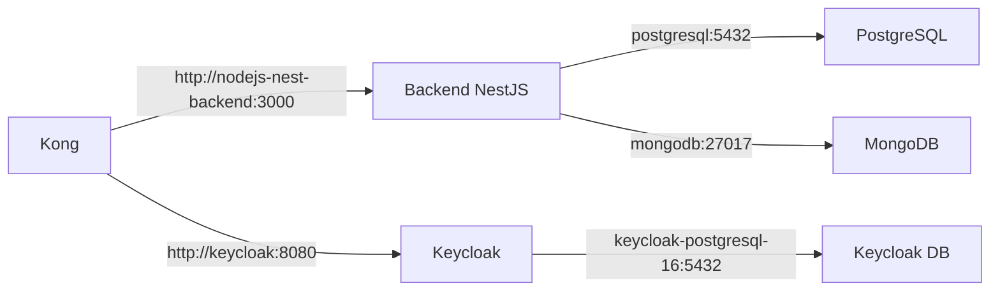
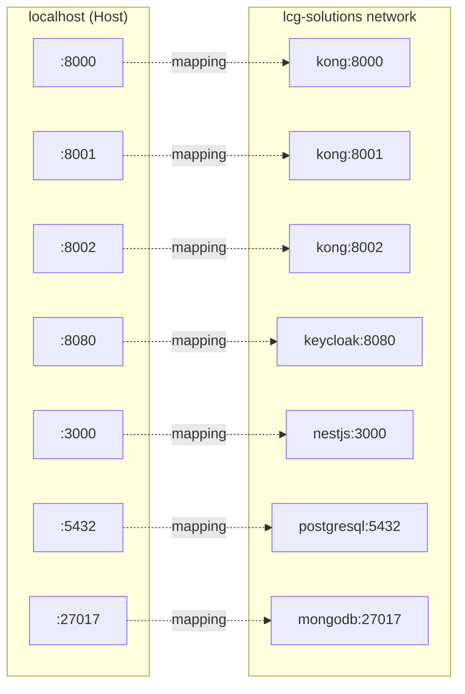
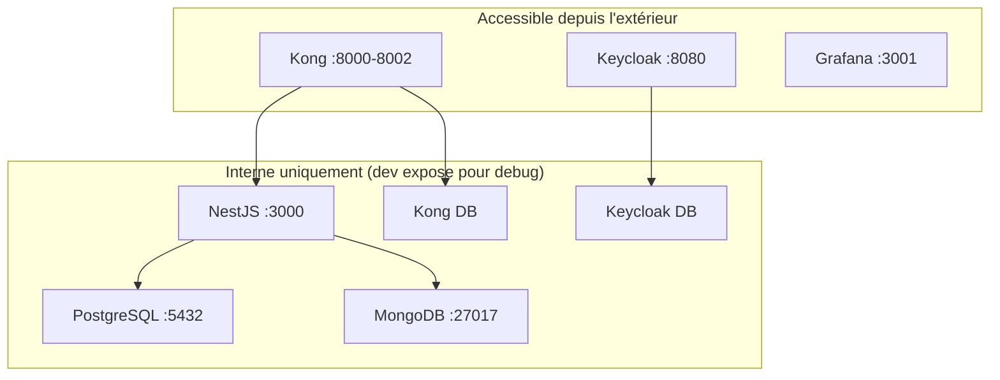
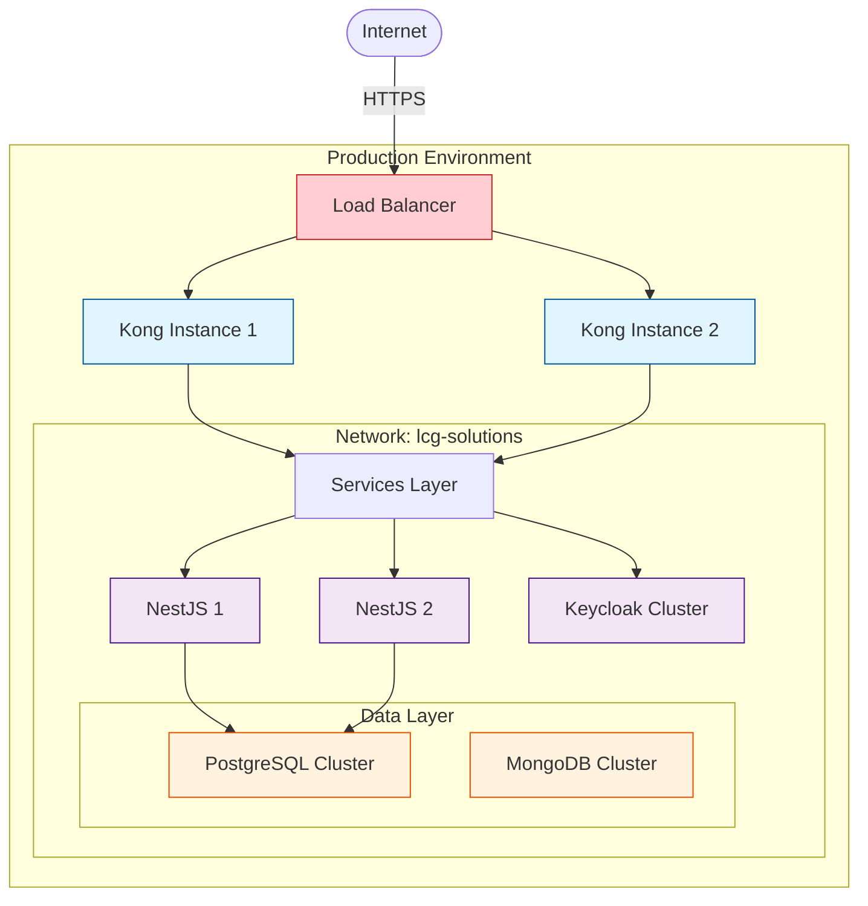

# Réseau Docker - SLHub

## Vue d'ensemble

Tous les services SLHub partagent un réseau Docker bridge nommé `lcg-solutions` pour communiquer entre eux.

## Topologie réseau



## Réseau lcg-solutions

### Configuration

```yaml
networks:
  lcg-solutions:
    name: lcg-solutions
    driver: bridge
    external: true
```

### Caractéristiques

- **Type** : Bridge
- **Nom** : lcg-solutions
- **Externe** : true (créé manuellement avant le démarrage)
- **DNS interne** : Les conteneurs se résolvent par leur nom

### Création du réseau

```bash
docker network create lcg-solutions
```

Le script `up.sh` crée automatiquement ce réseau s'il n'existe pas.

## Communication inter-services

### Résolution DNS

Chaque conteneur peut joindre les autres par leur nom de service :



### Exemples de connexion

#### Kong → Backend NestJS
```bash
# Dans Kong
Service URL: http://nodejs-nest-backend:3000
```

#### Backend NestJS → PostgreSQL
```bash
# Dans NestJS config
DB_HOST=postgresql
DB_PORT=5432
```

#### Backend NestJS → MongoDB
```bash
# Dans NestJS config
MONGO_URI=mongodb://mongodb:27017/mydb
```

#### Kong/NestJS → Keycloak
```bash
# URLs Keycloak
KEYCLOAK_URL=http://keycloak:8080
ISSUER=http://keycloak:8080/realms/slhub
```

## Exposition des ports

### Ports mappés (Host → Container)



### Tableau des ports

| Service | Port interne | Port externe | Usage |
|---------|--------------|--------------|-------|
| Kong Gateway | 8000 | 8000 | API Proxy HTTP |
| Kong Gateway | 8443 | 8443 | API Proxy HTTPS |
| Kong Admin | 8001 | 8001 | Admin API |
| Kong Manager | 8002 | 8002 | Interface Web |
| Keycloak | 8080 | 8080 | Console & API |
| Backend NestJS | 3000 | 3000 | API REST |
| PostgreSQL (App) | 5432 | 5432 | Base de données |
| PostgreSQL (Keycloak) | 5432 | 5433 | Base Keycloak |
| MongoDB | 27017 | 27017 | Base NoSQL |
| Grafana | 3000 | 3001 | Dashboard |
| Prometheus | 9090 | 9090 | Métriques |

## Isolation et sécurité

### Communication interne uniquement

Certains services ne devraient communiquer qu'en interne :



### En production

En production, retirer l'exposition des ports internes :

```yaml
# ❌ En dev (exposition pour debug)
ports:
  - "3000:3000"  # Backend accessible directement

# ✅ En production (pas d'exposition)
# ports:
#   - "3000:3000"
# Accès uniquement via Kong sur le port 8000
```

## Inspection du réseau

### Lister les conteneurs sur le réseau

```bash
docker network inspect lcg-solutions
```

### Voir les connexions actives

```bash
# Depuis le host
docker network inspect lcg-solutions | grep -A 5 "Containers"

# Depuis un conteneur
docker exec -it kong-gateway ping nodejs-nest-backend
```

### Tester la connectivité

```bash
# Tester Kong → NestJS
docker exec -it kong-gateway curl http://nodejs-nest-backend:3000/health

# Tester Kong → Keycloak
docker exec -it kong-gateway curl http://keycloak:8080/health
```

## Schéma de déploiement



## Troubleshooting

### Service ne peut pas joindre un autre service

```bash
# 1. Vérifier que les deux services sont sur le même réseau
docker inspect <container-name> | grep NetworkMode

# 2. Tester la résolution DNS
docker exec -it <container-name> nslookup <target-service-name>

# 3. Tester la connectivité
docker exec -it <container-name> ping <target-service-name>
```

### Recréer le réseau

```bash
# Arrêter tous les services
docker compose down

# Supprimer le réseau
docker network rm lcg-solutions

# Recréer le réseau
docker network create lcg-solutions

# Redémarrer les services
docker compose up -d
```
