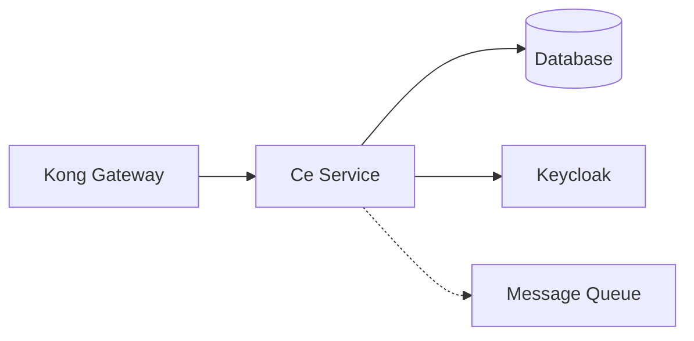

# [Nom du Service]

📦 **Stack:** [Framework] + [Langage] + [Base de données]

> Ce service fait partie de l'écosystème **[slhub](https://github.com/YOUR_USERNAME/slhub)**

## 📋 Description

[Description métier du service - Quel est le rôle de ce service dans l'architecture globale ?]

## 🛠️ Technologies

- **Framework:** [NestJS / Spring Boot / FastAPI / Actix / etc.]
- **Langage:** [TypeScript / Java / Python / Rust / Go / etc.]
- **Base de données:** [PostgreSQL / MongoDB / Redis / etc.]
- **Messaging:** [RabbitMQ / Kafka / NATS]
- **Authentification:** Keycloak (OAuth2/OIDC)
- **API Gateway:** Kong

## 🏗️ Architecture

### Position dans l'écosystème



### Endpoints exposés

| Méthode | Endpoint | Description | Auth requise |
|---------|----------|-------------|--------------|
| GET | `/api/[resource]` | Liste les ressources | ✅ |
| GET | `/api/[resource]/:id` | Détail d'une ressource | ✅ |
| POST | `/api/[resource]` | Créer une ressource | ✅ |
| PUT | `/api/[resource]/:id` | Mettre à jour | ✅ |
| DELETE | `/api/[resource]/:id` | Supprimer | ✅ |
| GET | `/health` | Health check | ❌ |

### Événements publiés

| Événement | Description | Payload |
|-----------|-------------|---------|
| `[resource].created` | Ressource créée | `{ id, data }` |
| `[resource].updated` | Ressource modifiée | `{ id, changes }` |
| `[resource].deleted` | Ressource supprimée | `{ id }` |

### Événements consommés

| Événement | Source | Action |
|-----------|--------|--------|
| `[event].name` | [autre-service] | [Action effectuée] |

## 🚀 Démarrage rapide

### Prérequis

- [Runtime/SDK] version X.X
- Docker & Docker Compose
- Accès au réseau Docker `lcg-solutions`

### Installation

```bash
# Cloner le repo
git clone https://github.com/YOUR_USERNAME/[nom-service]
cd [nom-service]

# Installer les dépendances
[npm install / mvn install / pip install -r requirements.txt / cargo build]

# Copier le fichier de configuration
cp .env.example .env

# Configurer les variables d'environnement (voir section Configuration)
```

### Démarrage en développement

```bash
# Sans Docker
[npm run dev / mvn spring-boot:run / uvicorn main:app --reload / cargo run]

# Avec Docker
docker compose up -d
```

Le service sera accessible sur `http://localhost:[PORT]`

### Démarrage via le hub slhub

```bash
# Depuis le repo slhub
cd /home/lcg/workspaces/slhub
./up.sh

# Le service sera automatiquement démarré et accessible via Kong
# http://localhost:8000/api/[resource]
```

## ⚙️ Configuration

### Variables d'environnement

```env
# Application
NODE_ENV=development
PORT=3000
SERVICE_NAME=[nom-service]

# Base de données
DB_HOST=localhost
DB_PORT=5432
DB_NAME=[dbname]
DB_USER=[user]
DB_PASSWORD=[password]

# Keycloak
KEYCLOAK_URL=http://localhost:8080
KEYCLOAK_REALM=slhub
KEYCLOAK_CLIENT_ID=[service-client-id]
KEYCLOAK_CLIENT_SECRET=[secret]

# Message Queue (optionnel)
RABBITMQ_URL=amqp://localhost:5672
KAFKA_BROKERS=localhost:9092

# Monitoring
PROMETHEUS_ENABLED=true
LOG_LEVEL=debug
```

### Configuration Keycloak

1. Créer un client dans le realm `slhub`
2. Client ID: `[nom-service]`
3. Client Type: `confidential`
4. Valid Redirect URIs: `http://localhost:8000/*`
5. Récupérer le client secret

### Configuration Kong

Le service est automatiquement enregistré dans Kong via le script de configuration du hub.

Routes Kong :
- `http://localhost:8000/api/[resource]` → ce service

## 🧪 Tests

```bash
# Tests unitaires
[npm test / mvn test / pytest / cargo test]

# Tests d'intégration
[npm run test:integration]

# Tests E2E
[npm run test:e2e]

# Coverage
[npm run test:coverage]
```

## 📦 Docker

### Build de l'image

```bash
docker build -t [nom-service]:dev .
```

### Structure Docker

```
[nom-service]/
├── Dockerfile
├── docker/
│   ├── compose.yaml          # Pour démarrage standalone
│   └── .env.example
```

### Réseau Docker

Le service doit être connecté au réseau `lcg-solutions` pour communiquer avec les autres services du hub.

```yaml
networks:
  services:
    name: lcg-solutions
    external: true
```

## 📊 Monitoring

### Métriques exposées

- `/metrics` - Métriques Prometheus
- `/health` - Health check
- `/health/live` - Liveness probe
- `/health/ready` - Readiness probe

### Logs

Les logs sont envoyés à stdout/stderr et collectés par le système de monitoring du hub.

Format de log :
```json
{
  "timestamp": "2025-01-15T10:30:00Z",
  "level": "info",
  "service": "[nom-service]",
  "message": "...",
  "context": {}
}
```

## 🗄️ Base de données

### Schéma

[Description du schéma de base de données]

### Migrations

```bash
# Créer une migration
[commande pour créer une migration]

# Exécuter les migrations
[commande pour exécuter les migrations]

# Rollback
[commande pour rollback]
```

## 🔒 Sécurité

- ✅ Authentification via Keycloak (JWT)
- ✅ Autorisation basée sur les rôles
- ✅ Validation des entrées
- ✅ Protection contre les injections SQL
- ✅ Rate limiting via Kong
- ✅ CORS configuré

### Rôles requis

| Endpoint | Rôles autorisés |
|----------|-----------------|
| GET /api/[resource] | `user`, `admin` |
| POST /api/[resource] | `admin` |
| PUT /api/[resource]/:id | `admin` |
| DELETE /api/[resource]/:id | `admin` |

## 📚 Documentation API

### Swagger/OpenAPI

Documentation interactive disponible sur :
- `http://localhost:[PORT]/api-docs`

### Exemples d'utilisation

#### Créer une ressource

```bash
curl -X POST http://localhost:8000/api/[resource] \
  -H "Authorization: Bearer $TOKEN" \
  -H "Content-Type: application/json" \
  -d '{
    "name": "Example"
  }'
```

#### Lister les ressources

```bash
curl -X GET http://localhost:8000/api/[resource] \
  -H "Authorization: Bearer $TOKEN"
```

## 🤝 Contribuer

1. Fork le projet
2. Créer une branche (`git checkout -b feature/amazing-feature`)
3. Commit les changements (`git commit -m 'Add amazing feature'`)
4. Push vers la branche (`git push origin feature/amazing-feature`)
5. Ouvrir une Pull Request

## 📝 Changelog

Voir [CHANGELOG.md](CHANGELOG.md) pour l'historique des changements.

## 📄 Licence

[MIT / Apache 2.0 / etc.]

## 🔗 Liens utiles

- [Hub slhub](https://github.com/YOUR_USERNAME/slhub)
- [Documentation Architecture](https://github.com/YOUR_USERNAME/slhub/tree/main/docs/architecture)
- [Kong Documentation](https://docs.konghq.com/)
- [Keycloak Documentation](https://www.keycloak.org/documentation)

## 👥 Auteurs

- **Votre Nom** - [@votre-username](https://github.com/votre-username)

## 🎯 Objectifs d'apprentissage

> Ce service a été créé dans le cadre d'un projet d'auto-formation sur les architectures microservices.

**Technologies apprises :**
- [Technologie 1]
- [Technologie 2]
- [Pattern 1]
- [Pattern 2]

**Concepts mis en pratique :**
- Architecture microservices
- OAuth2/OIDC
- API Gateway pattern
- Event-driven architecture
- Domain-Driven Design
- CQRS (si applicable)
- etc.
